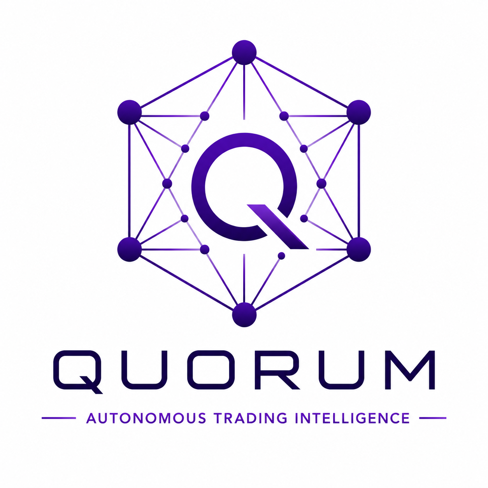
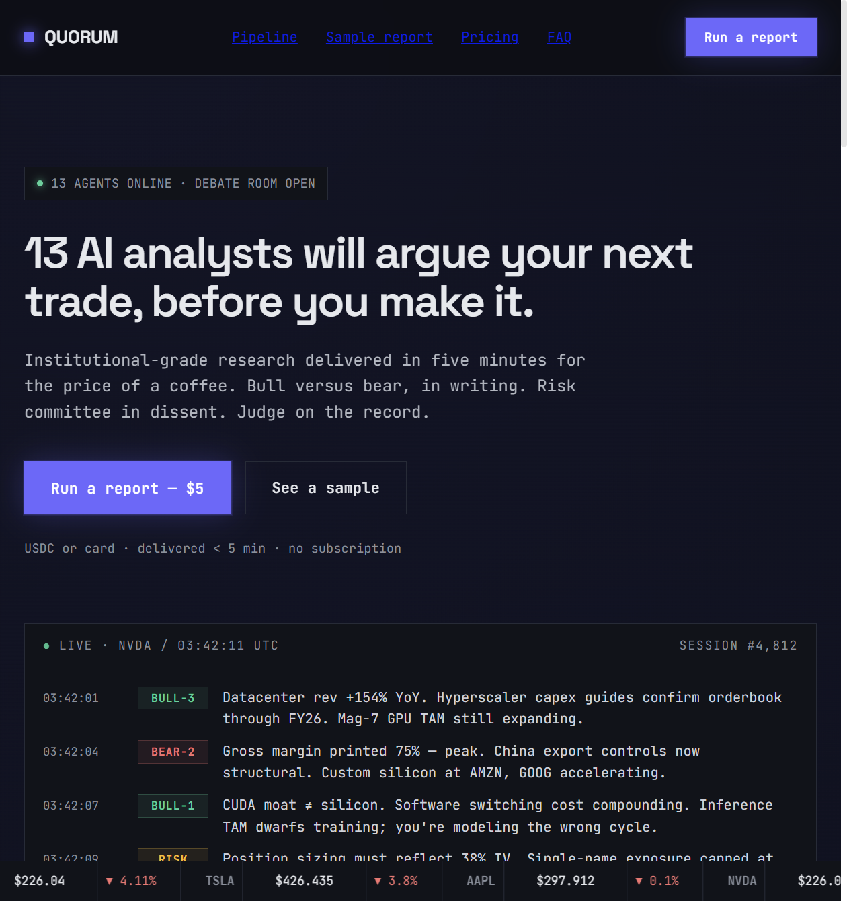
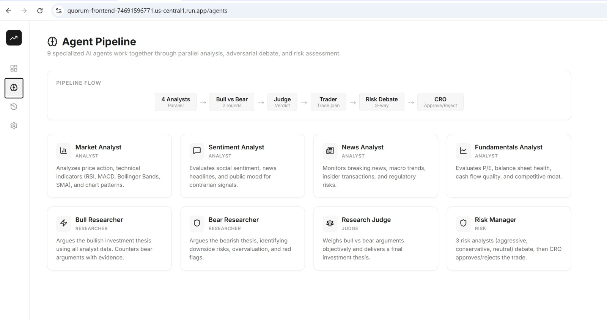
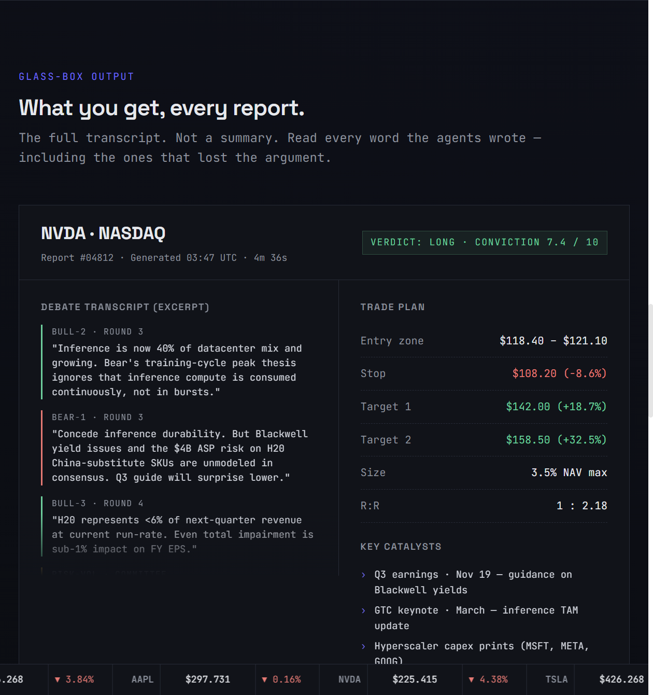
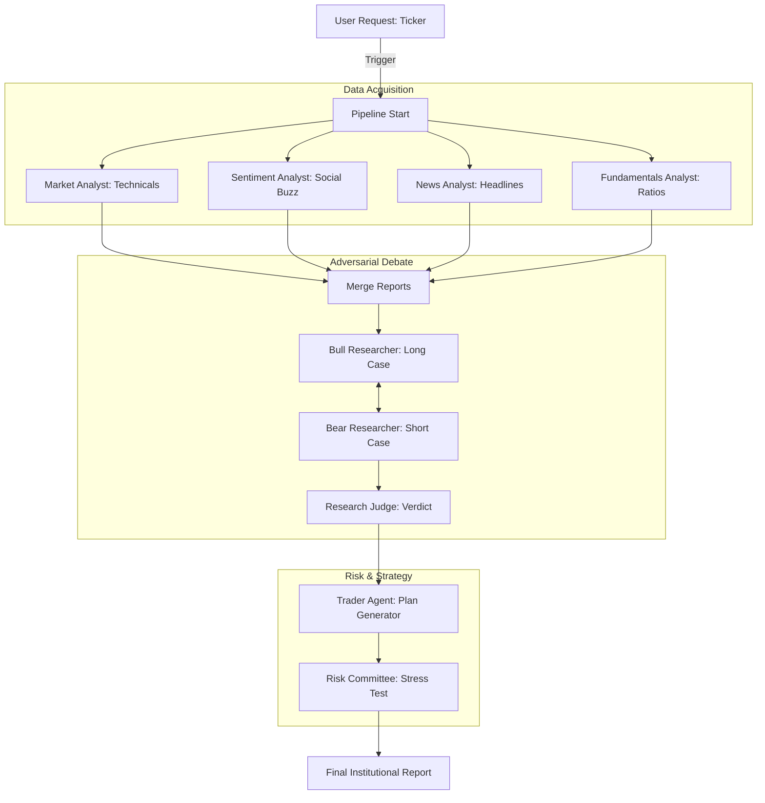

<p align="center">
  
</p>

<h1 align="center">Quorum</h1>

<p align="center">
  <strong>The Glass-Box AI Investment Framework — Powered by Locus</strong>
</p>

<p align="center">
  <a href="https://quorum-frontend-74691596771.us-central1.run.app"><strong>Live Demo</strong></a> ·
  <a href="#architecture"><strong>Architecture</strong></a> ·
  <a href="#monetization"><strong>Monetization</strong></a> ·
  <a href="docs/API_REFERENCE.md"><strong>API Reference</strong></a>
</p>

---

## 🏛️ Overview

Quorum is an autonomous AI investment research firm that employs a swarm of **13 specialized LLM agents** to analyze global markets. Unlike traditional "black-box" AI tools, Quorum operates as a **glass-box**: every argument, dissent, and rebuttal between agents is streamed live and captured in a high-fidelity institutional report.

Built for the **Locus Paygentic Hackathon**, Quorum leverages the Locus Protocol to monetize its intelligence, charging **$5 USDC (Base)** per analysis through a decentralized, agent-owned checkout system.

### 🌟 Key Features
- **Adversarial Reasoning**: Bull vs. Bear researchers engage in multi-round debates to surface hidden risks.
- **Risk Committee**: A multi-agent committee (Aggressive, Conservative, Neutral) stress-tests every signal.
- **Web3 Monetization**: Native USDC payments on the Base network via Locus.
- **War Room UI**: Real-time telemetry and agent logs streamed via WebSockets.
- **Glass-Box Reports**: Full transcripts of every agent's thought process — no hidden reasoning.

---

## 📸 Visual Showcase

### 1. The Command Center
The landing page allows users to query any Stock or Crypto ticker and initiates the Locus-powered checkout.


### 2. The War Room
Once payment is settled, users enter the "War Room" where they watch the 13 agents debate in real-time.


### 3. Final Institutional Report
The result is a comprehensive report card featuring a conviction score, executive summary, and a full adversarial transcript.


---

## 🤖 The Agent Swarm

Quorum utilizes a sophisticated DAG (Directed Acyclic Graph) powered by **LangGraph** to coordinate its 13 specialists.

### The Pipeline Flow


---

## 💳 Monetization (Locus Integration)

Quorum is a fully autonomous business. It uses **Locus** to manage its own revenue and billing:

- **Agent Wallet**: The backend hosts a Locus-managed wallet on the **Base network**.
- **USDC Settlement**: Reports are priced at **$5.00 USDC**.
- **Autonomous Checkout**: When a user requests a report, the `LocusFounder` agent generates a unique checkout session and monitors the blockchain for payment confirmation before unlocking the analysis.

---

## 🛠️ Tech Stack

| Layer | Technology |
|:------|:-----------|
| **Infrastructure** | Google Cloud Run, Locus Protocol (Base) |
| **Orchestration** | LangGraph, LangChain |
| **Intelligence** | Groq (Llama 3.3-70B & 3.1-8B) |
| **Frontend** | Next.js 15, TypeScript, Lucide Icons |
| **Backend** | FastAPI, WebSockets, Python 3.11 |
| **Data** | Alpaca Market API, yfinance, CCXT |
| **Persistence** | SQLite, ChromaDB (Vector Memory) |

---

## 🚀 Getting Started

### Prerequisites
- Python 3.11+ & Node.js 18+
- [Groq API Key](https://console.groq.com)
- [Locus Account](https://beta.paywithlocus.com) (Code: `PAYGENTIC`)

### Local Setup

1. **Clone & Install Backend**
   ```bash
   cd backend
   python -m venv venv
   source venv/bin/activate  # venv\Scripts\activate on Windows
   pip install -r requirements.txt
   cp .env.example .env  # Add your GROQ_API_KEY
   python -m uvicorn api.main:app --reload
   ```

2. **Install Frontend**
   ```bash
   cd frontend
   npm install
   npm run dev
   ```

3. **Access App**
   - Frontend: `http://localhost:3000`
   - API Docs: `http://localhost:8000/docs`

---

## 📜 License
This project is licensed under the MIT License - see the [LICENSE](LICENSE) file for details.

---

<p align="center">
  Built with ❤️ for the Locus Paygentic Hackathon.
</p>
