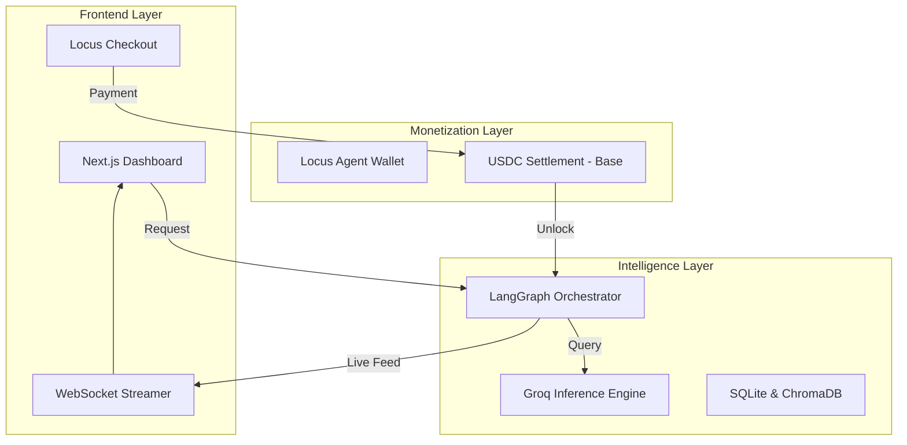
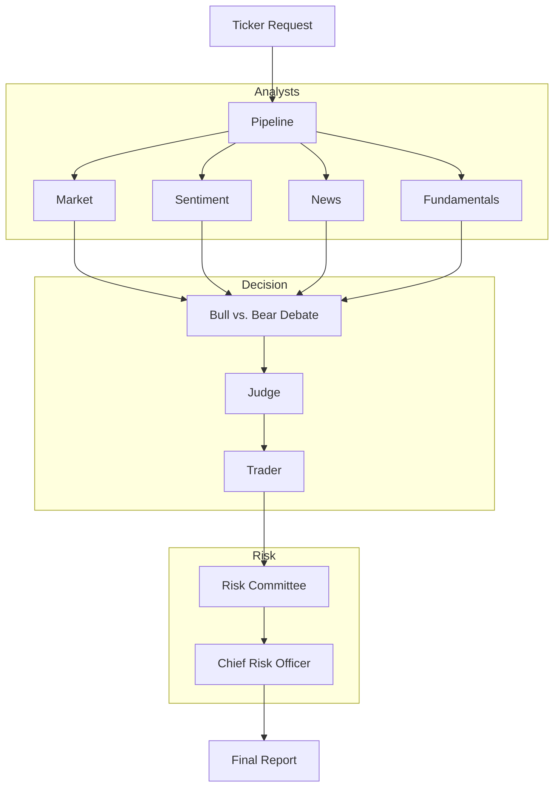

<p align="center">
  
</p>

<h1 align="center">Quorum</h1>

<p align="center">
  <strong>Multi-Agent LLM Trading Framework — Powered by Locus</strong>
</p>

---

## Deployment Links

| Service | URL |
|:---|:---|
| Frontend Dashboard | https://quorum-frontend-74691596771.us-central1.run.app |
| Backend API | https://quorum-backend-74691596771.us-central1.run.app |
| API Documentation | https://quorum-backend-74691596771.us-central1.run.app/docs |

---

## Hackathon and Locus Protocol

Quorum was developed specifically for the Locus Paygentic Hackathon (Week 4), participating in the LocusFounder track. The framework is designed to demonstrate how the Locus Protocol can transform traditional AI agent swarms into autonomous revenue-generating businesses.

By leveraging the LocusFounder SDK, Quorum manages its own fiscal lifecycle:
- Autonomous registration of an agent wallet on the Base network.
- Real-time USDC payment gating for high-compute analysis tasks.
- On-chain revenue tracking and session-based access control.

---

## Introduction

Quorum is an autonomous investment research framework designed for the Locus Paygentic Hackathon. The system utilizes a specialized swarm of 13 LLM agents to conduct deep-dive analysis on stocks and crypto assets. Quorum operates on a "glass-box" philosophy: rather than providing a single opaque score, it exposes the entire adversarial debate between its internal analysts, researchers, and risk officers.

The framework is fully monetized via the Locus Protocol, allowing it to function as a self-sustaining autonomous business that accepts USDC payments on the Base network.

---

## Visual Walkthrough

### Command Center
The landing page facilitates asset discovery and payment initiation via the Locus checkout system.


### War Room
Real-time telemetry streams the adversarial debate as agents cross-examine market data, sentiment, and fundamentals.


### Institutional Report
The final output is a structured investment thesis featuring conviction scores, execution plans, and the full debate transcript.


---

## System Architecture

Quorum's architecture is divided into three primary layers: the User Interface, the Agent Orchestration Layer, and the Monetization Layer.



---

## The 13-Agent Pipeline

The core logic is implemented as a Directed Acyclic Graph (DAG) using LangGraph. The pipeline follows a four-stage process:

1. **Intake & Analysis**: Four specialized analysts (Market, Sentiment, News, Fundamentals) gather and process raw data from Alpaca, Yahoo Finance, and CCXT.
2. **Adversarial Debate**: Three Bull researchers and three Bear researchers engage in a multi-turn debate. Each agent must address the opposing arguments or concede the point.
3. **Research Judge**: A senior agent reviews the debate transcript to issue a final verdict and investment thesis.
4. **Risk Committee**: A multi-perspective committee (Aggressive, Conservative, Neutral, and a CRO) stress-tests the trade plan against tail risks and liquidity constraints.

### Pipeline Flow


---

## Monetization and Locus Integration

Quorum integrates the Locus Protocol to handle autonomous revenue generation:

- **LocusFounder Integration**: The backend utilizes the Locus SDK to manage a dedicated agent wallet on the Base network.
- **Session Management**: Each analysis request triggers a unique Locus checkout session priced at 5.00 USDC.
- **Blockchain Verification**: The pipeline remains locked until the Locus status endpoint confirms the transaction on-chain.
- **Mock Flow**: For demonstration purposes, a mock settlement flow is implemented to simulate blockchain confirmation.

---

## Tech Stack

- **Frameworks**: Next.js 15, FastAPI, LangGraph, LangChain
- **Intelligence**: Groq (Llama 3.3-70B, 3.1-8B)
- **Infrastructure**: Google Cloud Run, Locus Protocol
- **Data Providers**: Alpaca Market API, Yahoo Finance, CCXT
- **Database**: SQLite (Relational), ChromaDB (Vector)
- **Styling**: Vanilla CSS with custom design tokens

---

## Environment Configuration

| Variable | Description |
|:---|:---|
| GROQ_API_KEYS | Semicolon-separated list of Groq API keys for rotation |
| ALPACA_API_KEY | Alpaca Market Data API Key |
| ALPACA_SECRET_KEY | Alpaca Market Data Secret Key |
| LOCUS_API_KEY | Locus Protocol API Key |
| LLM_CONCURRENCY | Number of parallel agent calls (Default: 2) |

---

## Getting Started

### Local Development

1. **Backend Setup**
   ```bash
   cd backend
   python -m venv venv
   source venv/bin/activate
   pip install -r requirements.txt
   python -m uvicorn api.main:app --reload
   ```

2. **Frontend Setup**
   ```bash
   cd frontend
   npm install
   npm run dev
   ```

3. **Verification**
   - Access the dashboard at `http://localhost:3000`
   - Access API documentation at `http://localhost:8000/docs`

---

## License

This project is licensed under the MIT License.
